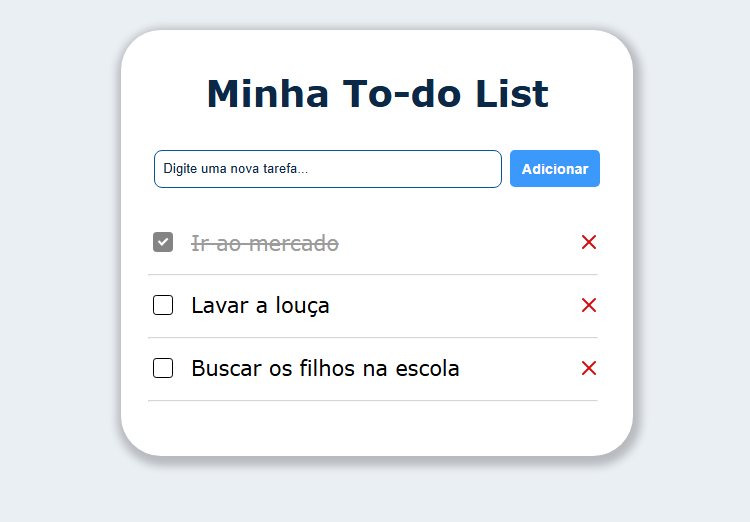

#  | Minha To-do List 
O projeto é uma lista de tarefas personalizada pelo usuário, cujo pode adicionar, marcar e excluir tarefas da lista conforme desejar.

    
    <a href="https://project-todo-list-nu.vercel.app">Link do projeto - Vercel</a>

## 🛠️ | Ferramentas utilizadas:
 &nbsp;
 &nbsp;
 

## ⚙ | Para adicionar:
- [ ] Botão Add-list: adicionar mais uma lista;
- [ ] Botão Edit: trocar o nome da lista;
- [ ] Botão Clear: limpar todas as tarefas da lista;
- [ ] Inserir tarefas novas com ENTER;
- [ ] Salvar tarefas entre sessões;

## 🎯 | Objetivos do projeto: 
O projeto foi desenvolvido com a ideia principal de praticar com as ferramentas HTML, CSS e Javascript, assim podendo solidificar e abranger os conhecimentos na criação de páginas web.  

Com isso, foi possível explorar atributos e propriedades dessas linguagens, sempre visando boas práticas e sua melhor utilização para cada caso.

## 🔍 | Dificuldades encontradas:

     
    
Falta de conhecimento em interatividade com o modelo DOM; 

    
    
Vocabulário enxuto de propriedades de estilização e formatação;

